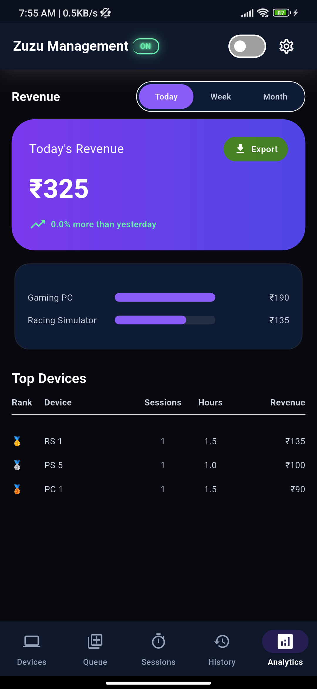
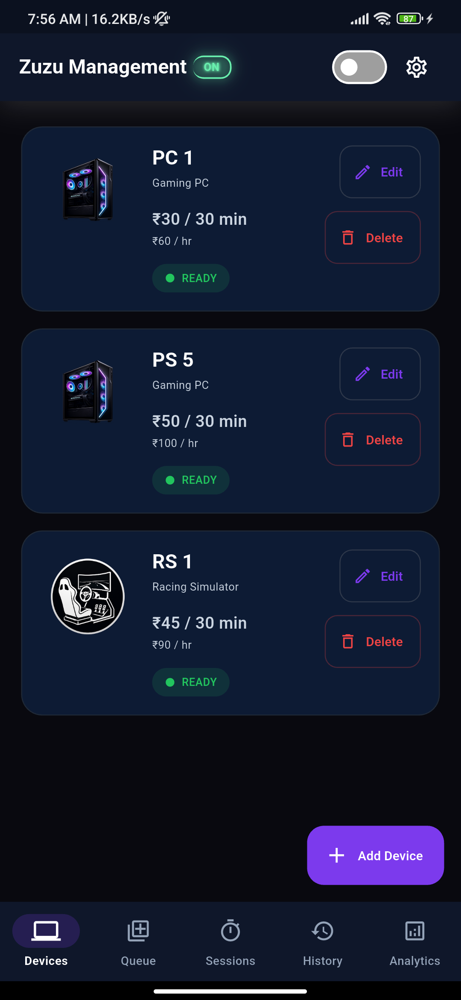
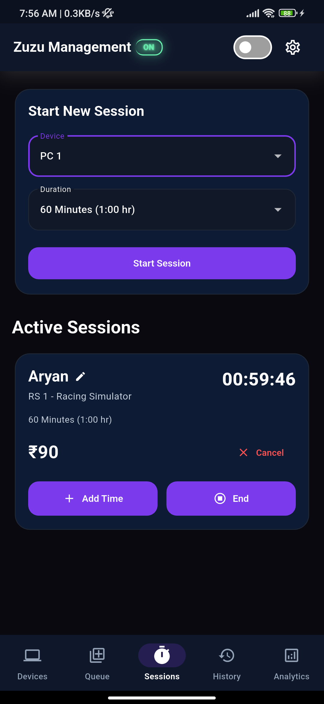
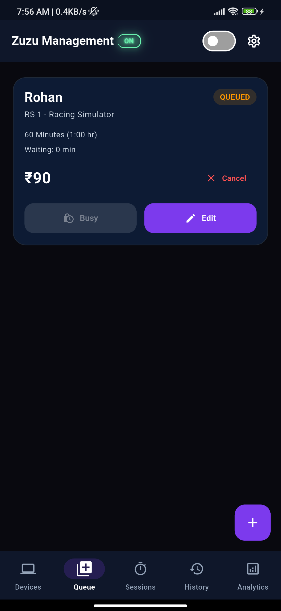
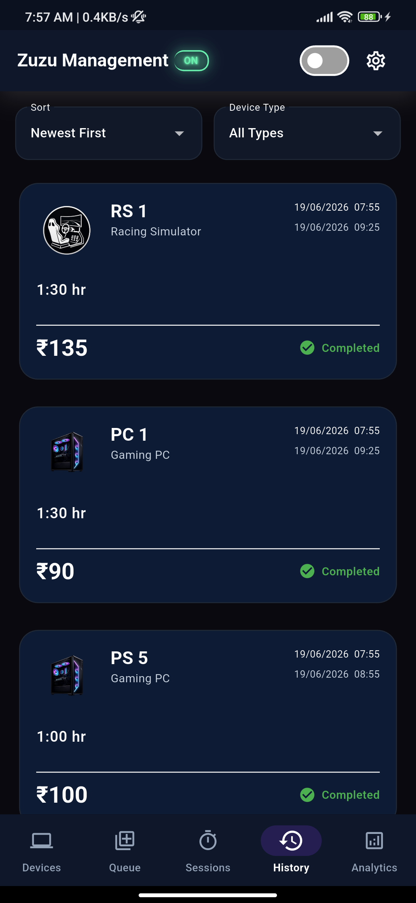
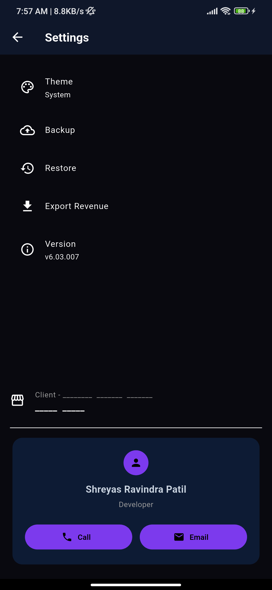

# 🎮 Gaming Cafe Manager - Zuzu Manage

A modern, offline-first Flutter application designed to streamline gaming cafe operations through real-time session management, revenue tracking, queue handling, and business analytics.

Built for gaming cafes, cyber cafes, esports lounges, and entertainment centers that require a simple, fast, and reliable management solution without depending on internet connectivity.

---

## 🚀 Overview

Gaming Cafe Manager provides an all-in-one platform for managing gaming devices, customer sessions, waiting queues, revenue tracking, and historical records.

The application is built using Flutter and SQLite, allowing it to run entirely offline while maintaining high performance and reliability.

---

## ✨ Features

### 🎯 Device Management

* Add gaming devices
* Edit device details
* Remove devices
* Configure custom pricing
* Support multiple device categories
* Device availability tracking

### ⏱ Session Management

* Start sessions instantly
* Real-time session timers
* Automatic billing calculations
* Pause and resume sessions
* Active session monitoring
* Revenue generation tracking

### 📋 Queue Management

* Customer waiting queue
* Queue prioritization
* Automatic queue handling
* Queue history tracking

### 📊 Analytics Dashboard

* Revenue insights
* Device performance analysis
* Business statistics
* Historical revenue trends
* Usage analytics

### 📚 History Tracking

* Completed sessions
* Revenue records
* Device usage history
* Business activity logs

### ⚙ Settings & Customization

* Theme management
* Text scaling
* Data export
* Backup support
* Application preferences

---

## 🛠 Technology Stack

### Frontend

* Flutter
* Dart

### Database

* SQLite
* sqflite

### State Management

* Local State Management

### Architecture

* Layered Architecture
* Modular Component Design
* Offline-First Approach

---

## 🎨 UI Highlights

* Professional dark theme
* Responsive layouts
* Clean navigation
* Reusable widget system
* Fast rendering performance
* Gaming-focused visual design

---

## 🔒 Core Business Rules

### Active Session Protection

During an active session:

* Device pricing cannot be modified
* Device type cannot be changed
* Session integrity remains protected

### Historical Data Preservation

Completed records remain unchanged even if:

* Device names change
* Device prices change
* Device categories change

This ensures accurate historical reporting and revenue tracking.

### Revenue Accuracy

Revenue is calculated automatically based on:

* Session duration
* Device pricing
* Session status

---

## 📂 Project Structure

For a detailed breakdown of the application's architecture, data flow, and module organization, see:

➡️ [ARCHITECTURE.md](./ARCHITECTURE.md)

---

## 🚀 Installation

### Clone Repository

```bash
git clone https://github.com/Shreyas-patil07/zuzu.git

cd zuzu
```

### Install Dependencies

```bash
flutter pub get
```

### Run Application

```bash
flutter run
```

---

## 📸 Screenshots

| Analytics | Devices |
|-----------|---------|
|  |  |

| Sessions | Queue |
|----------|-------|
|  |  |

| History | Settings |
|----------|----------|
|  |  |

---

## 📄 License

This project is proprietary software.

Copyright © 2026 Shreyas

All Rights Reserved.

Unauthorized copying, modification, distribution, sublicensing, publication, or commercial use of this software is strictly prohibited.

See LICENSE.md for complete licensing terms.

---

## 👨‍💻 Author

Shreyas

Computer Engineering Student

Built using Flutter, Dart, SQLite, and a passion for creating practical software solutions.
